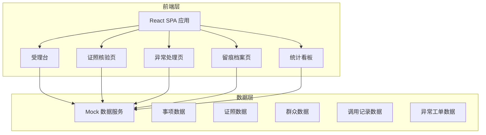
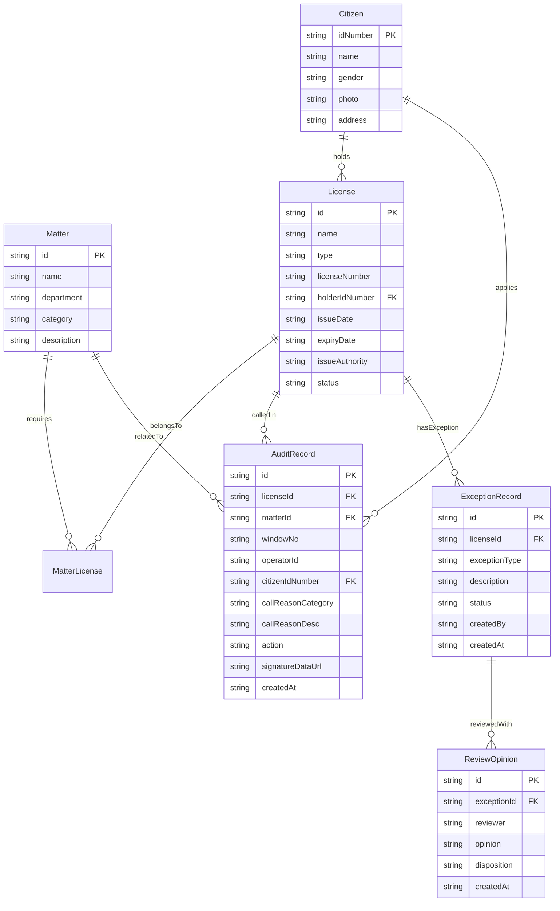

## 1. 架构设计



## 2. 技术说明

- **前端**：React@18 + TypeScript + Tailwind CSS@3 + Vite
- **初始化工具**：Vite
- **UI组件库**：Ant Design@5（适合政务后台风格）
- **图表库**：@ant-design/charts（统计看板）
- **路由**：React Router@6
- **状态管理**：Zustand
- **后端**：无后端，使用 Mock 数据模拟
- **数据持久化**：localStorage 用于留痕记录和签字数据持久化
- **签名组件**：react-signature-canvas

## 3. 路由定义

| 路由 | 用途 |
|------|------|
| / | 受理台 - 事项选择与证照清单 |
| /verify/:id | 证照核验页 - 证照核验与比对 |
| /exception | 异常处理页 - 异常登记与复核 |
| /audit | 留痕档案页 - 调用记录查看 |
| /dashboard | 统计看板 - 数据统计与分析 |

## 4. API定义

### 4.1 事项相关

```typescript
interface Matter {
  id: string
  name: string
  department: string
  category: string
  requiredLicenses: string[]
  description: string
}

interface MatterListResponse {
  matters: Matter[]
  total: number
}
```

### 4.2 群众相关

```typescript
interface Citizen {
  idNumber: string
  name: string
  gender: string
  photo: string
  address: string
}

interface CitizenQueryParams {
  idNumber: string
}
```

### 4.3 证照相关

```typescript
interface License {
  id: string
  name: string
  type: string
  licenseNumber: string
  holderName: string
  holderIdNumber: string
  issueDate: string
  expiryDate: string
  issueAuthority: string
  status: "normal" | "expired" | "revoked" | "lost"
  imageUrl: string
  fields: LicenseField[]
}

interface LicenseField {
  fieldName: string
  fieldValue: string
  matchFormFieldName: string
  matchResult: "match" | "mismatch" | "missing"
}

interface LicenseCallReason {
  category: "legal_requirement" | "material_verification" | "information_comparison"
  description: string
}
```

### 4.4 核验结果

```typescript
interface VerificationResult {
  licenseId: string
  expiryCheck: "valid" | "expiring_soon" | "expired"
  authorityCheck: "consistent" | "inconsistent"
  statusCheck: "normal" | "abnormal"
  fieldComparison: FieldComparison[]
  duplicateWarning: boolean
  missingLicenses: string[]
}

interface FieldComparison {
  formField: string
  formValue: string
  licenseField: string
  licenseValue: string
  result: "match" | "mismatch" | "missing"
}
```

### 4.5 异常与留痕

```typescript
interface ExceptionRecord {
  id: string
  licenseId: string
  exceptionType: "info_mismatch" | "expired" | "authority_anomaly" | "suspected_forgery"
  description: string
  attachments: string[]
  status: "pending" | "reviewing" | "resolved" | "rejected"
  reviewOpinions: ReviewOpinion[]
  createdAt: string
  createdBy: string
}

interface ReviewOpinion {
  reviewer: string
  opinion: string
  disposition: "return_supplement" | "manual_pass" | "escalate"
  createdAt: string
}

interface AuditRecord {
  id: string
  licenseId: string
  licenseName: string
  matterId: string
  matterName: string
  windowNo: string
  operatorId: string
  operatorName: string
  citizenId: string
  citizenName: string
  callReason: LicenseCallReason
  verificationResult: VerificationResult
  signatureDataUrl: string
  action: "view" | "download" | "call"
  createdAt: string
}
```

### 4.6 统计数据

```typescript
interface DashboardStats {
  totalCalls: number
  totalExceptions: number
  totalReturns: number
  callTrend: TrendItem[]
  callsByWindow: WindowCallItem[]
  callsByMatter: MatterCallItem[]
  returnReasons: ReturnReasonItem[]
  exceptionDistribution: ExceptionDistItem[]
}

interface TrendItem {
  date: string
  count: number
}

interface WindowCallItem {
  windowNo: string
  callCount: number
  exceptionCount: number
}

interface MatterCallItem {
  matterName: string
  callCount: number
  returnCount: number
}

interface ReturnReasonItem {
  reason: string
  count: number
  percentage: number
}

interface ExceptionDistItem {
  type: string
  count: number
  percentage: number
}
```

## 5. 数据模型

### 5.1 数据模型定义



## 6. 项目结构

```
src/
├── components/         # 公共组件
│   ├── Layout.tsx      # 全局布局（顶栏+侧栏+内容区）
│   ├── LicenseCard.tsx # 证照信息卡片
│   ├── SignPad.tsx     # 签字画布组件
│   └── StatusTag.tsx   # 状态标签组件
├── pages/
│   ├── Reception.tsx   # 受理台
│   ├── Verify.tsx      # 证照核验页
│   ├── Exception.tsx   # 异常处理页
│   ├── Audit.tsx       # 留痕档案页
│   └── Dashboard.tsx   # 统计看板
├── stores/            # Zustand 状态管理
│   ├── useMatterStore.ts
│   ├── useLicenseStore.ts
│   ├── useAuditStore.ts
│   └── useExceptionStore.ts
├── mock/              # Mock 数据
│   ├── matters.ts
│   ├── citizens.ts
│   ├── licenses.ts
│   ├── auditRecords.ts
│   └── exceptions.ts
├── types/             # TypeScript 类型定义
│   └── index.ts
├── utils/             # 工具函数
│   └── index.ts
├── App.tsx
├── main.tsx
└── index.css
```
